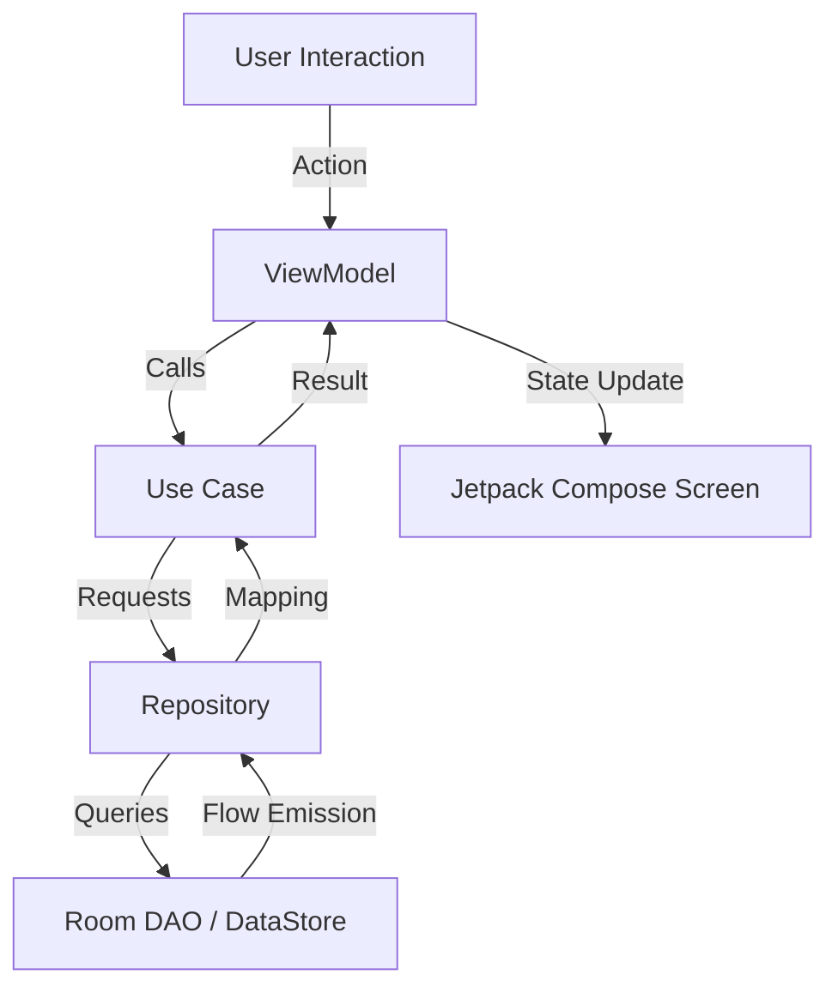

# 🏗 Project Architecture - Personal Finance Companion

The Personal Finance Companion app is built following **Modern Android Development (MAD)** practices and **Clean Architecture** principles. This ensures the codebase is maintainable, testable, and scalable.

---

## 🏛 Clean Architecture Layers

The project is divided into three main layers, following a strict dependency rule: **Inner layers do not know about outer layers.**

### 1. Presentation Layer (UI)
- **Framework**: [Jetpack Compose](https://developer.android.com/jetpack/compose) for 100% declarative UI.
- **Pattern**: **MVVM (Model-View-ViewModel)**.
- **State Management**: 
    - **UiState**: Every screen has a dedicated `UiState` (sealed interface) representing `Loading`, `Success`, and `Error`.
    - **StateFlow**: ViewModels expose state via `StateFlow` to ensure lifecycle-aware updates.
- **Navigation**: Type-safe navigation using Compose Navigation.

### 2. Domain Layer (Business Logic)
- **Independence**: This layer is pure Kotlin and has **zero Android dependencies**.
- **Models**: Defines plain data classes (POJOs) used across the app (e.g., `Transaction`, `Goal`).
- **Use Cases**: Encapsulates specific business rules (e.g., `CalculateBalanceUseCase`, `GetNoSpendStreakUseCase`).
- **Repositories (Interfaces)**: Defines contracts for data operations that the Data layer must implement.

### 3. Data Layer (Persistence)
- **Room Database**: Handles local storage for transactions, goals, and contributions.
- **DataStore**: Manages lightweight user preferences like Currency and Budget limits.
- **Repositories (Implementations)**: Orchestrates data flow between local databases and the rest of the app.
- **Mappers**: Converts DB Entities (Data Layer) to Domain Models (Domain Layer).

---

## 🔄 Data Flow (Reactive Pattern)

The app follows a unidirectional data flow (UDF) powered by Kotlin Flows:

1. **User Action**: User interacts with the UI (e.g., adds a transaction).
2. **ViewModel**: The UI calls a function in the ViewModel.
3. **Repository**: The ViewModel/UseCase updates the Repository.
4. **Reactive Update**: Room emits a new value through a `Flow`.
5. **UI Update**: The ViewModel receives the flow, updates `UiState`, and Compose recomposes the screen automatically.

---

## 💉 Dependency Injection (Hilt)

Hilt is used for dependency injection to ensure:
- **Decoupling**: Classes don't need to know how to create their dependencies.
- **Testability**: Dependencies can be easily mocked for Unit Tests.
- **Scope Management**: Provides Singleton for Database instance and Activity/ViewModel scoping for repositories.

---

## ⏱ Background Work (WorkManager)

- used for **Daily Reminders** and **Goal Progress Tracking**.
- Scheduled processes run reliably even if the app is closed or the device reboots.

---

> [!TIP]
> For a quick overview of coding patterns used in this project, refer to the [TECHNICAL_GUIDE.md](file:///d:/Projects/Android/PersonalFinanceCompanion/doc/TECHNICAL_GUIDE.md) in Hinglish.
