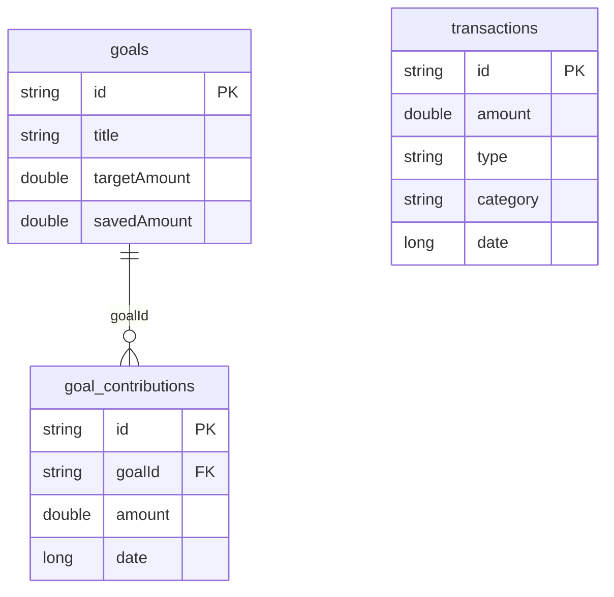

# 🗄 Database Schema - Personal Finance Companion

The app uses **Room** for complex relational data and **DataStore** for lightweight user preferences.

---

## 🏗 Room Database (SQLite)

The Room database contains three main entities. Relationships are managed using foreign keys to ensure data integrity.

### 1. `transactions`
Stores every income and expense entry.

| Column | Type | Description |
| :--- | :--- | :--- |
| `id` (PK) | String | Unique UUID for the transaction. |
| `amount` | Double | The monetary value. |
| `type` | String | `INCOME` or `EXPENSE`. |
| `category` | String | Category identifier (e.g., FOOD, RENT). |
| `date` | Long | Timestamp in milliseconds. |
| `notes` | String | Optional user description. |

### 2. `goals`
Financial goals set by the user.

| Column | Type | Description |
| :--- | :--- | :--- |
| `id` (PK) | String | Unique UUID for the goal. |
| `title` | String | Name of the goal (e.g., "New Car"). |
| `targetAmount` | Double | Goal's total target value. |
| `savedAmount` | Double | Cumulative amount saved so far. |
| `iconName` | String | Name of the Material icon assigned. |
| `colorHex` | String | Hex code for the UI theme of the goal. |
| `targetDate` | Long? | Optional deadline for the goal. |
| `priority` | Int | Importance level (0 = Normal, 1 = Urgent). |

### 3. `goal_contributions`
Individual savings entries for specific goals.

| Column | Type | Description |
| :--- | :--- | :--- |
| `id` (PK) | String | Unique UUID for the contribution. |
| `goalId` (FK) | String | References `goals.id`. (Cascade Delete enabled) |
| `amount` | Double | Amount contributed in this session. |
| `date` | Long | Timestamp of the contribution. |

---

## ⚙ User Preferences (DataStore)

Lightweight settings are stored in `Preferences DataStore`.

| Key | Type | Default | Description |
| :--- | :--- | :--- | :--- |
| `budget_limit` | Double | `0.0` | Maximum monthly spending limit. |
| `currency_code` | String | `INR` | User's preferred currency (e.g., USD, EUR). |
| `daily_reminder_enabled` | Boolean | `false` | Whether to send daily add-transaction alerts. |
| `reminder_time` | String | `20:00` | Preferred time for daily notifications. |
| `budget_alerts_enabled` | Boolean | `true` | Toggle for high-spending notifications. |
| `goal_reminders_enabled` | Boolean | `true` | Weekly goal progress reminders. |
| `no_spend_target` | Int | `30` | Goal for the "No Spend Challenge" duration. |

---

## 🗺 Entity Relationship Diagram

